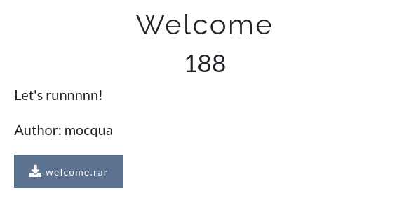

# ChristCTF write-up by B4n4n4

## Miscs
### 1. Discord channel


Vào kênh discord [ChristCTF](https://discord.gg/Rgj5VVpWf7) và lấy flag tại đầu kênh `Chém gió`.


Flag: ChristCTF{contactusifyouneed}

### 2. Index 


Ta có thể tìm thấy flag tại trang chủ của web: 

Rorate tấm ảnh 90 độ ta có thể thấy được flag ở ngay đó.

Flag: ChristCTF{Welc0me_to_PIS}

### 3. Pha ke Vi Em


Khi kết nối vào link mình được dẫn tới 1 ubuntu server:

```
Welcome to Ubuntu 18.04.2 LTS (GNU/Linux 4.15.0-55-generic x86_64)
* Documentation:  https://help.ubuntu.com
* Management:     https://landscape.canonical.com
* Support:        https://ubuntu.com/advantage

* Introducing self-healing high availability clusters in MicroK8s.
Simple, hardened, Kubernetes for production, from RaspberryPi to DC.

	https://microk8s.io/high-availability

* Canonical Livepatch is available for installation.
- Reduce system reboots and improve kernel security. Activate at:
https://ubuntu.com/livepatch
77 packages can be updated.
0 updates are security updates.

New release '20.04.1 LTS' available.
-------------------------------------------------------------------------
> Welcome to PIS's self-made Ubuntu virtual machine
> Version:	1.0
> Release Date:	Dec 20 2020
> Developer:	ryh
> Association:	PTITHCM Information Security Club
-------------------------------------------------------------------------
Run 'help' to get instructions
Run 'quit' to exit this virtual machine
-------------------------------------------------------------------------
Spend a while to look around. Enjoy ❤

~$ 
```

Kiểm tra thì mình thấy có sự xuất hiện của 3 file:

```
~$ ls
flag.txt  challenge  challenge.c
~$ file challenge
challenge: setgid ELF 64-bit LSB shared object, x86-64, version 1 (SYSV), dynamically linked, interpreter /lib64/ld-linux-x86-64.so.2, for GNU/Linux 3.2.0, BuildID[sha1]=ed99644fb8c1fdb20487a854fc9c66155ce8c483, not stripped
~$ file flag.txt
flag.txt: ASCII text
~$ file challenge.c
challenge.c: C source, ASCII text
~$ cat flag.txt
Access denied. This incident will be reported.
~$ cat challenge.c
#include <stdio.h>
#include <stdlib.h>
#include <string.h>
char buf[32];
int main(int argc, char* argv[], char* envp[]){
        if(argc<2){
                printf("pass argv[1] a number\n");
                return 0;
        }
        int fd = atoi( argv[1] ) - 0x1234;
        int len = 0;
        len = read(fd,buf,32);
        if(!strcmp("PIS2020\n", buf)){
                printf("good job :)\n");
                system("cat flag.txt");
                exit(0);
        }
        printf("learn about linux file IO\n");
        return 0;
}
~$
```

Ta không thể đọc được file `flag.txt` bằng cách thông thường nhưng ta có thể đọc đoạn code `challenge.c` và ta thấy đoạn code `system("cat flag.txt");`. Vậy là ta có thể lấy được flag thông qua file `challenge`. Mình thấy là để có thể thực hiện được câu lệnh `system()` thì điều kiện `strcmp("PIS2020\n",buf)` trong `if` phải bằng `0` hay `!strcmp()` sẽ bằng 1, nghĩa là `buf` phải bằng với `"PIS2020\n"` lên trên 1 chút thì ta thấy có lệnh `read(fd,buf,32)` nếu như `fd` bằng `0` (file descriptor: 0 for STDIN) thì ta có thể nhập được input từ và khi đó ta sẽ nhập `"PIS2020\n"`. Và có thể thấy là `int fd = atoi(argv[1]) - 0x1234` vậy nên ta sẽ input argument là `0x1234` (Nhưng mà là ở dạng dec :v hay là `4660`). And....

```
~$ ./challenge 4660
PIS2020
good job :)
Submit this flag: ChristCTF{N0w_Y0u_Und3r$tanD_L1nuX_f1l3_IO}
Remember to do your write-up. ❤
~$  
```

Flag: ChristCTF{N0w_Y0u_Und3r$tanD_L1nuX_f1l3_IO}

### 4. Free flag 


Như đề bài thì mình đã nhận được flag ngay sau khi làm xong phần khảo sát :v 

Flag: ChristCTF{Happy_new_year_2021!Happy_hacking}

## Trivia game

Do dãy chall này khá ngắn nên mình sẽ gộp nó vào làm 1 :v  

* 1. Một câu lệnh được sử dụng thường xuyên nhất trong linux cho phép tạo files, xem nội dung file, nối các file...  
Flag: cat
* 2. Các quyền cơ bản của một user và group trên linux là...  
(đáp án ghi thường, không viết tắt, cách nhau bởi dấu _ , thứ tự các quyền trên câu trả lời đúng theo thứ tự xuất hiện trên máy linux)  
Flag: execute_read_write_deny
* 3. Ai là user quyền lực nhất trên linux? (đáp án viết thường)  
Flag: root
* 4. Làm sao để xem được file ẩn trong linux (Sử dung cách đơn giản và thường gặp nhất) (đáp án viết thường)  
Flag: ls -a
* 5. Ai là cha đẻ của ngôn ngữ C? (Cách viết theo quy tắc tên riêng như thường)  
Flag: Dennis Ritchie
* 6. Phần mở rộng của file thực thi trên linux?  
Flag: elf
* 7. Vùng chứa những dữ liệu được khai báo nhưng chưa gán giá trị? (đáp án ghi thường, viết tắt)  
Flag: bss
* 8. malloc(0x10) cho ta một vùng dữ liệu bao nhiêu bytes? (đáp án dưới dạng số hệ 10)  
Flag: 24

## Reverse 
### 1. Welcome
  
Khi giải nén tập tin `welcome.rar` ta được file `welcome.exe` và khi run ta sẽ có được flag.
```
b4n4n4 in ~/Downloads λ wine welcome.exe 
ChristCTF{w311c0m3_t0_r3v3sr3}%
b4n4n4 in ~/Downloads λ 
```
Flag: ChristCTF{w311c0m3_t0_r3v3sr3}