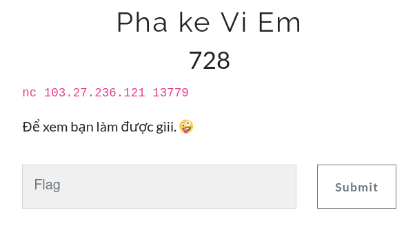

# ChristCTF write-up by B4n4n4

## Miscs
### 1. Discord channel


Vào kênh discord [ChristCTF](https://discord.gg/Rgj5VVpWf7) và lấy flag tại đầu kênh `Chém gió`.


Flag: ChristCTF{contactusifyouneed}

### 2. Index 


Ta có thể tìm thấy flag tại trang chủ của web: 

Rorate tấm ảnh 90 độ ta có thể thấy được flag ở ngay đó.

Flag: ChristCTF{Welc0me_to_PIS}

### 3. Pha ke Vi Em


Khi kết nối vào link mình được dẫn tới 1 ubuntu server:

```
Welcome to Ubuntu 18.04.2 LTS (GNU/Linux 4.15.0-55-generic x86_64)
* Documentation:  https://help.ubuntu.com
* Management:     https://landscape.canonical.com
* Support:        https://ubuntu.com/advantage

* Introducing self-healing high availability clusters in MicroK8s.
Simple, hardened, Kubernetes for production, from RaspberryPi to DC.

	https://microk8s.io/high-availability

* Canonical Livepatch is available for installation.
- Reduce system reboots and improve kernel security. Activate at:
https://ubuntu.com/livepatch
77 packages can be updated.
0 updates are security updates.

New release '20.04.1 LTS' available.
-------------------------------------------------------------------------
> Welcome to PIS's self-made Ubuntu virtual machine
> Version:	1.0
> Release Date:	Dec 20 2020
> Developer:	ryh
> Association:	PTITHCM Information Security Club
-------------------------------------------------------------------------
Run 'help' to get instructions
Run 'quit' to exit this virtual machine
-------------------------------------------------------------------------
Spend a while to look around. Enjoy ❤

~$ 
```

Kiểm tra thì mình thấy có sự xuất hiện của 3 file:

```
~$ ls
flag.txt  challenge  challenge.c
~$ file challenge
challenge: setgid ELF 64-bit LSB shared object, x86-64, version 1 (SYSV), dynamically linked, interpreter /lib64/ld-linux-x86-64.so.2, for GNU/Linux 3.2.0, BuildID[sha1]=ed99644fb8c1fdb20487a854fc9c66155ce8c483, not stripped
~$ file flag.txt
flag.txt: ASCII text
~$ file challenge.c
challenge.c: C source, ASCII text
~$ cat flag.txt
Access denied. This incident will be reported.
~$ cat challenge.c
#include <stdio.h>
#include <stdlib.h>
#include <string.h>
char buf[32];
int main(int argc, char* argv[], char* envp[]){
        if(argc<2){
                printf("pass argv[1] a number\n");
                return 0;
        }
        int fd = atoi( argv[1] ) - 0x1234;
        int len = 0;
        len = read(fd,buf,32);
        if(!strcmp("PIS2020\n", buf)){
                printf("good job :)\n");
                system("cat flag.txt");
                exit(0);
        }
        printf("learn about linux file IO\n");
        return 0;
}
~$
```

Ta không thể đọc được file `flag.txt` bằng cách thông thường nhưng ta có thể đọc đoạn code `challenge.c` và ta thấy đoạn code `system("cat flag.txt");`. Vậy là ta có thể lấy được flag thông qua file `challenge`. Mình thấy là để có thể thực hiện được câu lệnh `system()` thì điều kiện `strcmp("PIS2020\n",buf)` trong `if` phải bằng `0` hay `!strcmp()` sẽ bằng 1, nghĩa là `buf` phải bằng với `"PIS2020\n"` lên trên 1 chút thì ta thấy có lệnh `read(fd,buf,32)` nếu như `fd` bằng `0` (file descriptor: 0 for STDIN) thì ta có thể nhập được input từ và khi đó ta sẽ nhập `"PIS2020\n"`. Và có thể thấy là `int fd = atoi(argv[1]) - 0x1234` vậy nên ta sẽ input argument là `0x1234` (Nhưng mà là ở dạng dec :v hay là `4660`). And....

```
~$ ./challenge 4660
PIS2020
good job :)
Submit this flag: ChristCTF{N0w_Y0u_Und3r$tanD_L1nuX_f1l3_IO}
Remember to do your write-up. ❤
~$  
```

Flag: ChristCTF{N0w_Y0u_Und3r$tanD_L1nuX_f1l3_IO}

### 4. Free flag 


Như đề bài thì mình đã nhận được flag ngay sau khi làm xong phần khảo sát :v 

Flag: ChristCTF{Happy_new_year_2021!Happy_hacking}

## Trivia game

Do dãy chall này khá ngắn nên mình sẽ gộp nó vào làm 1 :v  

* 1. Một câu lệnh được sử dụng thường xuyên nhất trong linux cho phép tạo files, xem nội dung file, nối các file...  
Flag: cat
* 2. Các quyền cơ bản của một user và group trên linux là...  
(đáp án ghi thường, không viết tắt, cách nhau bởi dấu _ , thứ tự các quyền trên câu trả lời đúng theo thứ tự xuất hiện trên máy linux)  
Flag: execute_read_write_deny
* 3. Ai là user quyền lực nhất trên linux? (đáp án viết thường)  
Flag: root
* 4. Làm sao để xem được file ẩn trong linux (Sử dung cách đơn giản và thường gặp nhất) (đáp án viết thường)  
Flag: ls -a
* 5. Ai là cha đẻ của ngôn ngữ C? (Cách viết theo quy tắc tên riêng như thường)  
Flag: Dennis Ritchie
* 6. Phần mở rộng của file thực thi trên linux?  
Flag: elf
* 7. Vùng chứa những dữ liệu được khai báo nhưng chưa gán giá trị? (đáp án ghi thường, viết tắt)  
Flag: bss
* 8. malloc(0x10) cho ta một vùng dữ liệu bao nhiêu bytes? (đáp án dưới dạng số hệ 10)  
Flag: 24

## Reverse 
### 1. Welcome
  
Khi giải nén tập tin `welcome.rar` ta được file `welcome.exe` và khi run ta sẽ có được flag.
```
b4n4n4 in ~/Downloads λ wine welcome.exe 
ChristCTF{w311c0m3_t0_r3v3sr3}%
b4n4n4 in ~/Downloads λ 
```
Flag: ChristCTF{w311c0m3_t0_r3v3sr3}

### 2. Waiting to new year

Khi giải nén file `Waiting.zip` ta nhận được file `Waiting` định dạng ELF và khi chạy thử :v
```
b4n4n4 in ~/Downloads λ ./Waiting
Time has passed without meaning, I want today to be the first day of 2021.

```
Và rất lâu sau đó không có gì xảy ra cả :v mình quyết định quăng file này vào `ida-64` để đọc code cho dễ :v 
khi mình decompile hàm `main()` thì mình nhận được như này :>
```
int __cdecl main(int argc, const char **argv, const char **envp)
{
  __asm { rep nop edx }
  sub_1080(Message, argv);
  PrintFlag((__int64)Message, (__int64)argv);
  return 0;
}
```
Và hàm sub_1080 kia mình không decompile được nên đành đọc code assembly vậy :v
```
.plt.sec:0000000000001080 ; =============== S U B R O U T I N E =======================================
.plt.sec:0000000000001080
.plt.sec:0000000000001080
.plt.sec:0000000000001080 sub_1080        proc near               ; CODE XREF: Flag+18p
.plt.sec:0000000000001080                                         ; PrintFlag+14p ...
.plt.sec:0000000000001080                 rep nop edx
.plt.sec:0000000000001084                 repne jmp cs:printf_ptr
.plt.sec:0000000000001084 sub_1080        endp
.plt.sec:0000000000001084
.plt.sec:0000000000001084 ; ---------------------------------------------------------------------------
.plt.sec:000000000000108B                 align 10h
.plt.sec:0000000000001090
```
Oh vậy đây là hàm in ra màn hình `.__.` vậy dòng chữ hàm này in ra là `Time has passed without meaning, I want today to be the first day of 2021.` ta có thể biết được khi ấn vào `Message` :v  
Tiếp theo là hàm `PrintFlag()`:
```
.text:0000000000001231 ; =============== S U B R O U T I N E =======================================
.text:0000000000001231
.text:0000000000001231
.text:0000000000001231 ; void __cdecl PrintFlag()
.text:0000000000001231                 public PrintFlag
.text:0000000000001231 PrintFlag       proc near               ; CODE XREF: main+1Ep
.text:0000000000001231                 rep nop edx
.text:0000000000001235                 push    rbp
.text:0000000000001236                 mov     rbp, rsp
.text:0000000000001239                 lea     rdi, aWaitingFor5Day ; "\nWaiting for 5 days....."
.text:0000000000001240                 mov     eax, 0
.text:0000000000001245                 call    sub_1080			<== printf_ptr()
.text:000000000000124A                 mov     edi, 69780h
.text:000000000000124F                 mov     eax, 0
.text:0000000000001254                 call    sub_1090			<== sleep()
.text:0000000000001259                 mov     eax, 0
.text:000000000000125E                 call    Flag
.text:0000000000001263                 nop
.text:0000000000001264                 pop     rbp
.text:0000000000001265                 retn
.text:0000000000001265 PrintFlag       endp
.text:0000000000001265
.text:0000000000001266
```
Mình phát hiện ra hàm `sub_1090` là hàm sleep:
```
.plt.sec:0000000000001090 ; =============== S U B R O U T I N E =======================================
.plt.sec:0000000000001090
.plt.sec:0000000000001090
.plt.sec:0000000000001090 sub_1090        proc near               ; CODE XREF: PrintFlag+23p
.plt.sec:0000000000001090                 rep nop edx
.plt.sec:0000000000001094                 repne jmp cs:sleep_ptr
.plt.sec:0000000000001094 sub_1090        endp
.plt.sec:0000000000001094
.plt.sec:0000000000001094 ; ---------------------------------------------------------------------------
.plt.sec:000000000000109B                 align 20h
.plt.sec:000000000000109B _plt_sec        ends
.plt.sec:000000000000109B
```
Và 1 điều nữa là có dòng print bên trên in ra `"\nWaiting for 5 days....."` và mình check thử giá trị của `edx (69780h)` và nó bằng đúng 432000s hay 5 ngày = ))))
PATCH GIÁ TRỊ NÓ VỀ 0 NÀO = )))))
Và sau khi patch giá trị mình đã chạy lại và nhận được flag = ))))  
```
b4n4n4 in ~/Downloads λ ./Waiting    
Time has passed without meaning, I want today to be the first day of 2021.
Waiting for 5 days.....
Flag is: ChristCTF{Wa1t1ng_t0_n3w_y3ar}% 
```
Flag: ChristCTF{Wa1t1ng_t0_n3w_y3ar}

### 3. Merry Christmas

Khi giải nén `MerryChristmas.zip` mình nhận đc 1 file ELF và khi chạy:
```
b4n4n4 in ~/Downloads λ ./MerryChristmas 
Do you have someone for this Christmas?
Flag is: 
Do you see the flag?
b4n4n4 in ~/Downloads λ 
```
Mình thử tìm string bằng `strings` và phát hiện ra:
```
...
_unused2
stderr
_IO_backup_base
_freeres_list
DebugToFlag				<=== what's this? :>>
main
_IO_write_base
crtstuff.c
deregister_tm_clones
...
```
Vậy là debug là có flag à `.___.` debug thử nào:
```
gdb-peda$ disass main
Dump of assembler code for function main:
   0x000000000000130d <+0>:	endbr64 
   0x0000000000001311 <+4>:	push   rbp
   0x0000000000001312 <+5>:	mov    rbp,rsp
   0x0000000000001315 <+8>:	lea    rdi,[rip+0x2d04]        # 0x4020 <Message>
   0x000000000000131c <+15>:	mov    eax,0x0
   0x0000000000001321 <+20>:	call   0x1090 <printf@plt>
   0x0000000000001326 <+25>:	mov    eax,0x0
   0x000000000000132b <+30>:	call   0x11b9 <Flag>		<=== what's this? :>>
   0x0000000000001330 <+35>:	lea    rdi,[rip+0xcd8]        # 0x200f
   0x0000000000001337 <+42>:	call   0x1070 <puts@plt>
   0x000000000000133c <+47>:	mov    eax,0x0
   0x0000000000001341 <+52>:	pop    rbp
   0x0000000000001342 <+53>:	ret    
End of assembler dump.
```
Disassemble tiếp hàm `Flag` nào:
```
...
   0x00000000000012d0 <+279>:	mov    ecx,edx
   0x00000000000012d2 <+281>:	xor    ecx,eax
   0x00000000000012d4 <+283>:	mov    eax,DWORD PTR [rbp-0x84]
   0x00000000000012da <+289>:	cdqe   
   0x00000000000012dc <+291>:	lea    rdx,[rip+0x2d7d]        # 0x4060 <DebugToFlag>
   0x00000000000012e3 <+298>:	mov    BYTE PTR [rax+rdx*1],cl
   0x00000000000012e6 <+301>:	add    DWORD PTR [rbp-0x84],0x1
   0x00000000000012ed <+308>:	cmp    DWORD PTR [rbp-0x84],0x1a
   0x00000000000012f4 <+315>:	jle    0x12b1 <Flag+248>
   0x00000000000012f6 <+317>:	nop
...
```
Mình thấy đoạn này có vẻ quan trọng này `.___.`
Mình sẽ đặt break point ngay hàm Flag và chạy thử:
```
gdb-peda$ 
[----------------------------------registers-----------------------------------]
RAX: 0x1a 
RBX: 0x555555555350 (<__libc_csu_init>:	endbr64)
RCX: 0x7d ('}')
RDX: 0x555555558060 ("ChristCTF{M3rry_Chr1stmas!}")
RSI: 0x55555555600e --> 0x756f79206f440a00 ('')
RDI: 0x7ffff7fa74c0 --> 0x0 
RBP: 0x7fffffffde20 --> 0x7fffffffde30 --> 0x0 
RSP: 0x7fffffffdd90 --> 0x0 
RIP: 0x5555555552ed (<Flag+308>:	cmp    DWORD PTR [rbp-0x84],0x1a)
R8 : 0x0 
R9 : 0xa ('\n')
R10: 0x555555556004 ("\nFlag is: ")
R11: 0x246 
R12: 0x5555555550a0 (<_start>:	endbr64)
R13: 0x7fffffffdf20 --> 0x1 
R14: 0x0 
R15: 0x0
EFLAGS: 0x206 (carry PARITY adjust zero sign trap INTERRUPT direction overflow)
[-------------------------------------code-------------------------------------]
   0x5555555552dc <Flag+291>:	lea    rdx,[rip+0x2d7d]        # 0x555555558060 <DebugToFlag>
   0x5555555552e3 <Flag+298>:	mov    BYTE PTR [rax+rdx*1],cl
   0x5555555552e6 <Flag+301>:	add    DWORD PTR [rbp-0x84],0x1
=> 0x5555555552ed <Flag+308>:	cmp    DWORD PTR [rbp-0x84],0x1a
   0x5555555552f4 <Flag+315>:	jle    0x5555555552b1 <Flag+248>
   0x5555555552f6 <Flag+317>:	nop
   0x5555555552f7 <Flag+318>:	mov    rax,QWORD PTR [rbp-0x8]
   0x5555555552fb <Flag+322>:	xor    rax,QWORD PTR fs:0x28
[------------------------------------stack-------------------------------------]
0000| 0x7fffffffdd90 --> 0x0 
0008| 0x7fffffffdd98 --> 0x1bf7fe0d50 
0016| 0x7fffffffdda0 --> 0x700000007 
0024| 0x7fffffffdda8 --> 0x1000000052 
0032| 0x7fffffffddb0 --> 0x10000001c 
0040| 0x7fffffffddb8 --> 0x3c00000063 ('c')
0048| 0x7fffffffddc0 --> 0xd00000027 ("'")
0056| 0x7fffffffddc8 --> 0x1300000028 
[------------------------------------------------------------------------------]
Legend: code, data, rodata, value
0x00005555555552ed	22	in /home/konoha/Desktop/MerryChristmas/main.c
gdb-peda$ 
```
Ez :>>>  
Flag: ChristCTF{M3rry_Chr1stmas!}

### 4. theRoom 

Bài này đại khái là mình sẽ phải nhập password hợp lý aka Flag thì mới đúng và tìm trong file bằng `IDA` mình thấy có 1 hàm `checkPass()` và mình đã viết hàm để decrypt đoạn này và lấy đc flag = )))))))
```
#include <bits/stdc++.h>
using namespace std;
int main() {
    char temp[] = "X1t`E1toc`Em3H^\"xxxSPFeaHA^I\0";
    char v1;
    int i, j;

    for (i = 0; i <= 15; ++i) {
        if (i & 1)
            v1 = temp[i] - 1;
        else
            v1 = temp[i] + 1;
        temp[i] = v1;
    }
    temp[16] = '_';
    temp[18] = 'x';
    temp[17] = '0';

    for (j = 19; j < strlen(temp); ++j) {
        if (temp[j] > 'I' || temp[j] <= '?')
            temp[j] += 17;
        else
            temp[j] -= 16;
    }
    cout << temp << endl;
    return 0;
}
```
Flag: ChristCTF{Y0u_F0und_Fl4G_!_0xda6vr81o9}

### 5. Game
  
Do bài này làm mình dỗi nên mình viết ngắn gọn }:<  
Đầu tiên mình `grep -r ChristCTF` và mình ra flag giả trong `level1`  
Mình `strings level1` để xem thử thì thấy 1 link drive.google, và vào thì tải về đc 1 file `*.dat`  
và khi `grep -a Christ *.dat` thì mình đã ra được flag  
Flag: ChristCTF{DanG_COng_San_VIETNAM_Mu0n_NAm}
